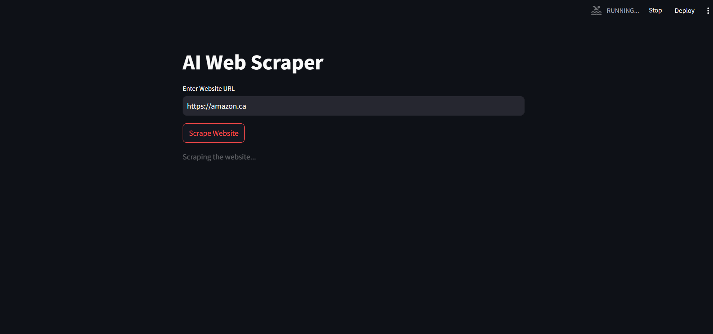
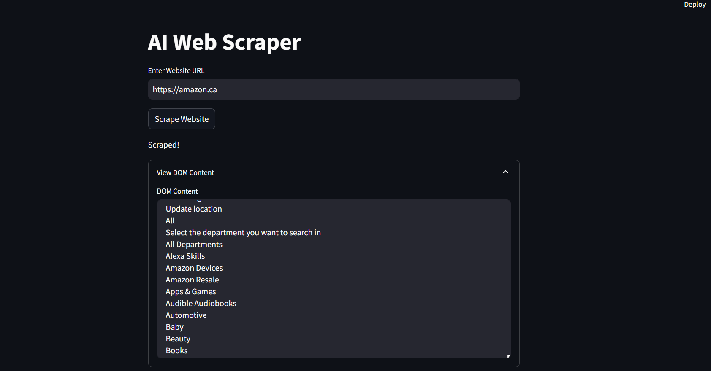
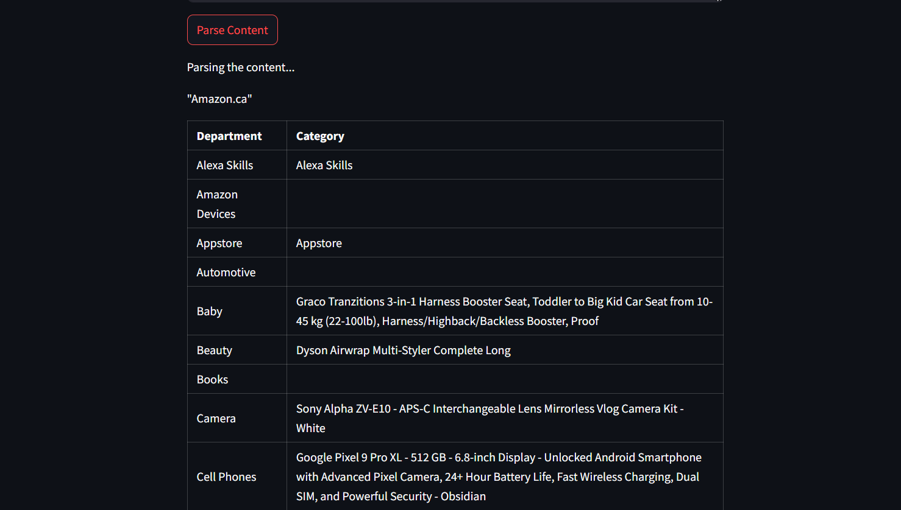
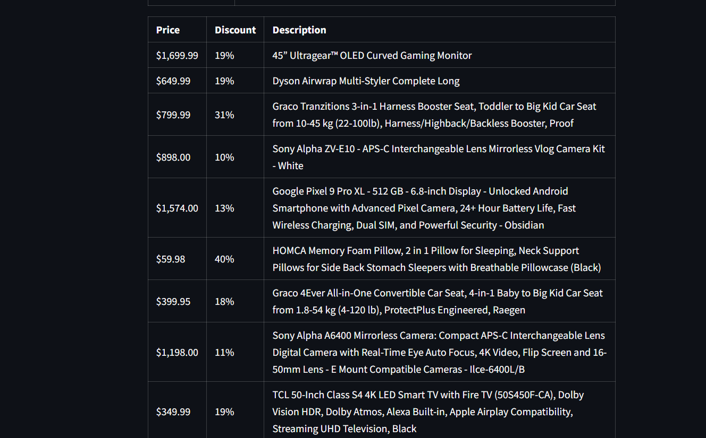
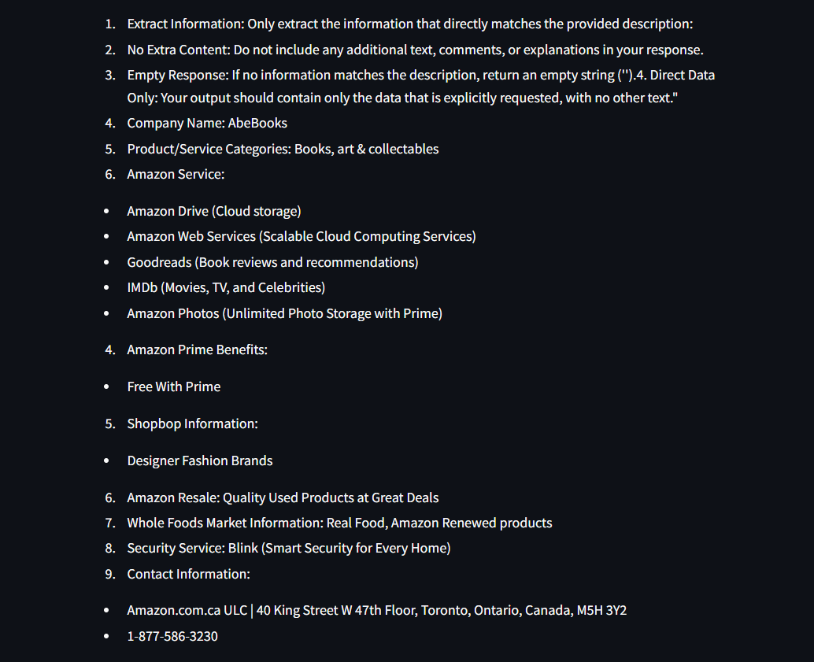
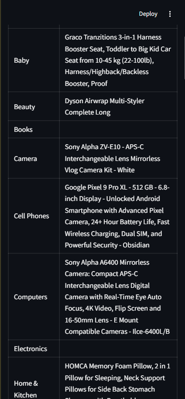

# AI Web Scraper with Streamlit

This project is a web scraping tool powered by AI, built using Streamlit. It allows users to scrape the content of a website, clean and extract the relevant DOM content, and then parse the content using an AI model (Ollama) to answer specific questions or extract specific information.

## Features

- **Web Scraping**: Scrape the DOM content of any website by providing its URL.
- **Content Cleaning**: Extract and clean the body content of the website for better readability.
- **AI-Powered Parsing**: Use an AI model (Ollama) to parse the scraped content and answer user-defined questions or extract specific information.
- **Streamlit UI**: A user-friendly interface to interact with the scraper and parser.

## Demo

Here are some screenshots of the application in action:

---

---

---

---

---

---
<p align="center">
  
</p>
---

## Installation

1. **Clone the Repository**:
   ```bash
   git clone https://github.com/your-username/ai-web-scraper.git
   cd ai-web-scraper
2. **Set Up a Virtual Environment (Optional but Recommended)**:
```
python -m venv venv
source venv/bin/activate  # On Windows, use `venv\Scripts\activate`
```
3. **Install Dependencies**:
```
pip install -r requirements.txt
```

4. **Run the Streamlit App**:
```
streamlit run app.py
Access the App:
Open your browser and navigate to http://localhost:8501 to use the AI Web Scraper.
```
## Usage

1. **Enter a Website URL**:
   - Input the URL of the website you want to scrape in the provided text box.

2. **Scrape the Website**:
   - Click the "Scrape Website" button to extract and clean the DOM content of the website.

3. **View the Scraped Content**:
   - Once the scraping is complete, you can view the cleaned DOM content in an expandable text box.

4. **Parse the Content**:
   - Describe what you want to parse or extract from the scraped content in the text area provided.
   - Click the "Parse Content" button to let the AI model process the content and provide the results.

## Dependencies

- **Streamlit**: For building the web interface.
- **BeautifulSoup**: For web scraping and DOM manipulation.
- **Ollama**: For parsing and extracting information using AI.

## Project Structure

```plaintext
ai-web-scraper/
├── app.py                # Main Streamlit application
├── scrape.py             # Functions for scraping and cleaning website content
├── parse.py              # Functions for parsing content using Ollama
├── requirements.txt      # List of dependencies
├── README.md             # This file
```

## Contributing

Contributions are welcome! If you'd like to contribute, please follow these steps:

1. Fork the repository.
2. Create a new branch for your feature or bugfix.
3. Commit your changes.
4. Push your branch and submit a pull request.

## License

This project is licensed under the MIT License. See the [LICENSE](LICENSE) file for details.
